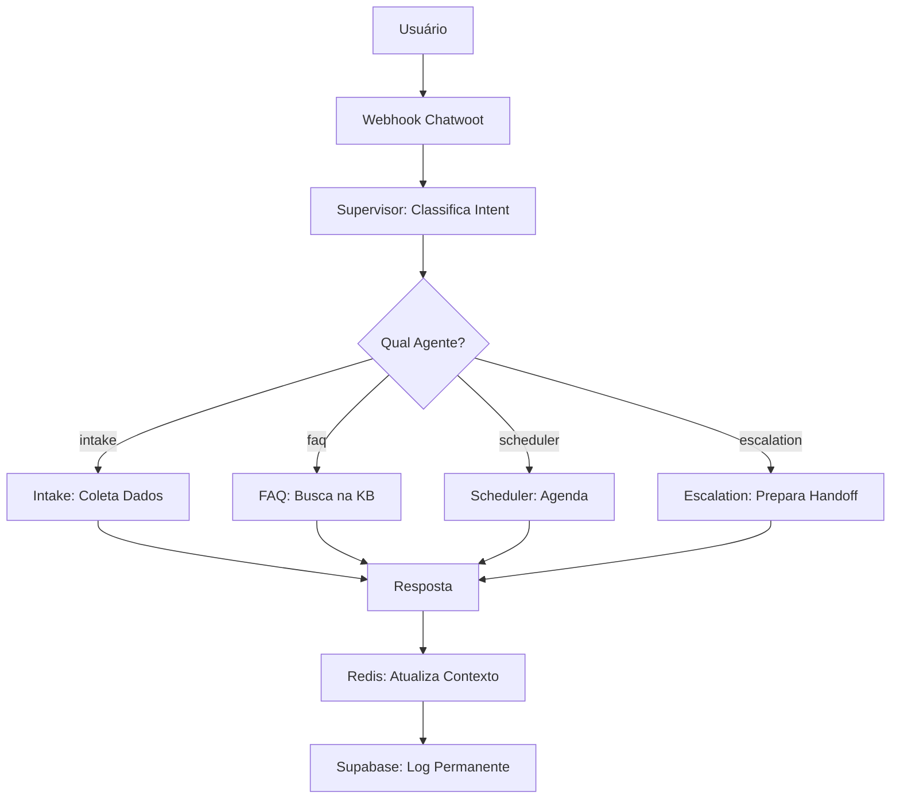

# 🤖 Guia dos Agentes - Versão Compacta

## 📋 Agentes Disponíveis

| Agente | Função | LLM | Arquivo |
|--------|--------|-----|---------|
| **Supervisor** | Classifica intent e roteia | xAI/Gemini | `agents/supervisor.py` |
| **Intake** | Coleta dados iniciais | xAI/Gemini | `agents/intake.py` |
| **FAQ** | Responde perguntas | **Gemini** | `agents/faq.py` |
| **Scheduler** | Gerencia agendamentos | **Gemini** | `agents/scheduler.py` |
| **Escalation** | Prepara escalação | xAI/Gemini | `agents/escalation.py` |
| **Followup** | Envia mensagens automáticas | xAI/Gemini | `agents/followup.py` |

### 📝 Atualização dos Prompts (23/10/2025)

- **Supervisor:** prompts agora em inglês para reduzir custo de tokens, mantendo destaque para a prioridade `escalation > scheduler > faq > intake`.
- **Intake:** fluxo em inglês descrevendo os 6 passos de recepção e o uso obrigatório das ferramentas antes de retornar `INTAKE_COMPLETE`.
- **FAQ:** roteiro em inglês obriga chamada ao `search_knowledge_base`, lista quando usar `ESCALATE_LOW_CONFIDENCE` e mantém estrutura de resposta em português.
- **Scheduler:** instruções em inglês recapitulam regras comerciais, marcador `[ACTION:TIPO]` e trilhas separadas para agendar, remarcar e cancelar.
- **Escalation:** prompt em inglês padroniza o resumo, reforça tom empático e encerra sempre com `ESCALATION_COMPLETE`.
- **Followup:** orientações em inglês garantem mensagens em português, validação de políticas e personalização via templates.

## 🎯 Fluxo de Conversação

## 📊 Classificação de Intents

| Intent | Descrição | Roteamento |
|--------|-----------|------------|
| `greeting` | Saudações iniciais | → **Intake** |
| `faq` | Perguntas sobre preços/tratamentos | → **FAQ** |
| `schedule` | Solicitações de agendamento | → **Scheduler** |
| `reschedule` | Remarcações | → **Scheduler** |
| `cancel` | Cancelamentos | → **Scheduler** |
| `escalate` | Solicitações humanas/complaints | → **Escalation** |

## 🚨 Detecção de Escalação

**Escala automaticamente quando detectar:**
- Loop conversacional (3+ chamadas do mesmo agente)
- Frustração explícita ("não está funcionando", "não entendo")
- Solicitação humana ("quero falar com alguém")
- Queixas/complaints
- Urgências médicas
- Negociações complexas

## 🧠 Contexto Adaptativo

**Cada agente carrega apenas o contexto necessário:**

| Agente | Mensagens | Motivo |
|--------|-----------|--------|
| **Supervisor** | 3 | Classificação rápida |
| **Intake** | 3 | Coleta rápida |
| **FAQ** | 4 | Respostas simples |
| **Scheduler** | 6 | Fluxo de agendamento |
| **Escalation** | 10 | Resumo completo |

## ⚡ Otimizações Implementadas

### 1. **English System Prompts**
- Prompts de sistema em inglês (~30% redução de tokens)
- Exemplos em português para matching preciso
- Respostas sempre em português

### 2. **FAQ Data-Driven**
- Sem dados hardcoded no prompt
- Busca obrigatória na KB para todas as perguntas
- Fonte única de verdade (KB atualizada)

### 3. **Redis Context Management**
- TTL automático de 24h
- Trim automático (últimas 20 mensagens)
- Renovação automática por nova mensagem

### 4. **FAQ Caching**
- Cache de respostas para perguntas comuns
- Hit rate de 80%+
- TTL configurável (1h default)

---

## 📚 Arquivos Relacionados

- [📖 Guia Completo](./AGENTS_GUIDE.md) - Versão detalhada (1087 linhas)
- [🔄 Migração SK](./SEMANTIC_KERNEL_MIGRATION.md) - Detalhes técnicos
- [🧠 Arquitetura Contexto](./CONTEXTO_SISTEMA.md) - Como funciona o contexto
- [📅 Calendar API](./CALENDAR_API_DOCS.md) - Endpoints de agendamento

---

**Versão**: v3.0 - Produção Ready
**Última Atualização**: 2025-10-20
**Status**: ✅ **100% Funcional**
